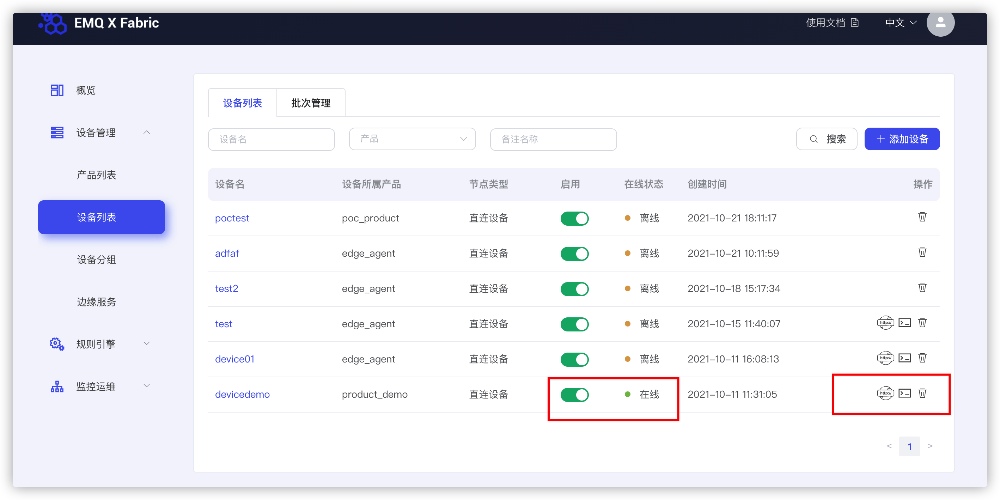
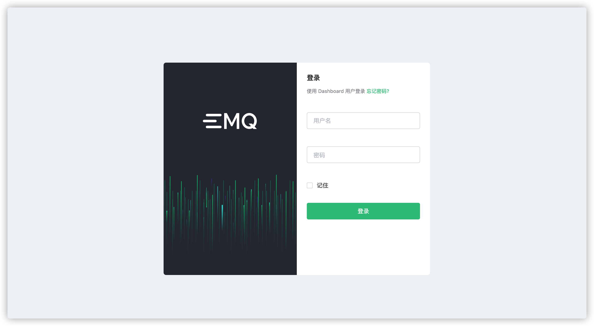
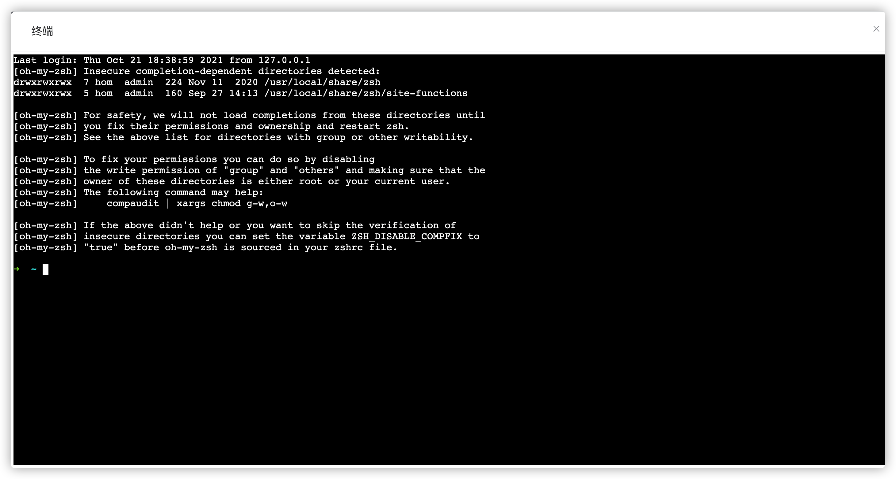

# 什么是 ssh/http 通道
平台提供的中继服务，用户可通过该中继服务从外部网络直接访问局域网内的设备的 ssh/http 服务。

## 使用说明
使用 ssh/http 通道需要在设备端安装我们的 Agent 客户端，由 Agent 负责与平台建立 tcp 通道

## 获取edge-agent
[edge-agent-bin-x86_64.tar.gz](https://static.emqx.net/fabric/edge-agent-0.6.3/edge-agent-bin-x86_64.tar.gz)

[edge-agent-bin-aarch64.tar.gz](https://static.emqx.net/fabric/edge-agent-0.6.3/edge-agent-bin-aarch64.tar.gz)

[edge-agent-bin-armv7.tar.gz](https://static.emqx.net/fabric/edge-agent-0.6.3/edge-agent-bin-armv7.tar.gz)

## 前置要求
首先用户需要[创建产品](../quick_start/create_product.md)和[创建设备](../quick_start/create_device)。

## 参数配置
将设备的三元组信息，更新到 edge-agent 的配置文件 config.yaml。

```yaml
---
device_name: Raspberry
product_key: KS8D0G1U 
secret: 87b3883794faa3a12e9b9e61642a8703
observer_interval: 1000
update_interval: 10000

comp_list:
- category: 4
  node_type: 7
  name: edge_1
  endpoint: http://127.0.0.1:8081
  url: http://127.0.0.1:8081/api/v4
  api_version: 1
  key: 292MY64LSUBEUJVDAGYG
  secret: 92MY64L
  status: 0
  broker: localhost:1883
  auto_recover: 1
  auto_start: 1
- category: 4
  node_type: 6
  name: ssh_1
  endpoint: 127.0.0.1:5043
  url: 127.0.0.1:22 
  api_version: 1
  status: 0
  broker: localhost:1883
  auto_recover: 1
  auto_start: 1

```

然后根据自己的需求，修改 config.yaml 文件

```Yaml
  - category: 4 默认为4
  node_type: 6表示ssh通道，7表示http通道
  name: 服务名
  endpoint: 服务地址
  url: 服务的ping接口
  api_version: 版本
  key: 292MY64LSUBEUJVDAGYG // 可选
  secret: 92MY64L // 可选
  status: 0 状态初始值为0
  broker: 连接到的broker地址
  auto_recover: 是否支持自恢复
  auto_start: 是否支持自启动
```

如图，当 agent 主动上报数据后，设备列表页面对应的设备会显示在线，并且右侧会有 https 和控制台图标。点击图标会建立安全通道。



这里我们以 emqx 的 dashboard 为例，当点击https按钮时，会跳转到一个新的页面如图所示。



当点击控制台按钮时，会得到如图，这里提供了两种认证方式，一种是通过用户名、密码，另外一种是使用用户名、私钥的方式，当填好相应信息，就可以进入我们边缘端的控制台，如图



